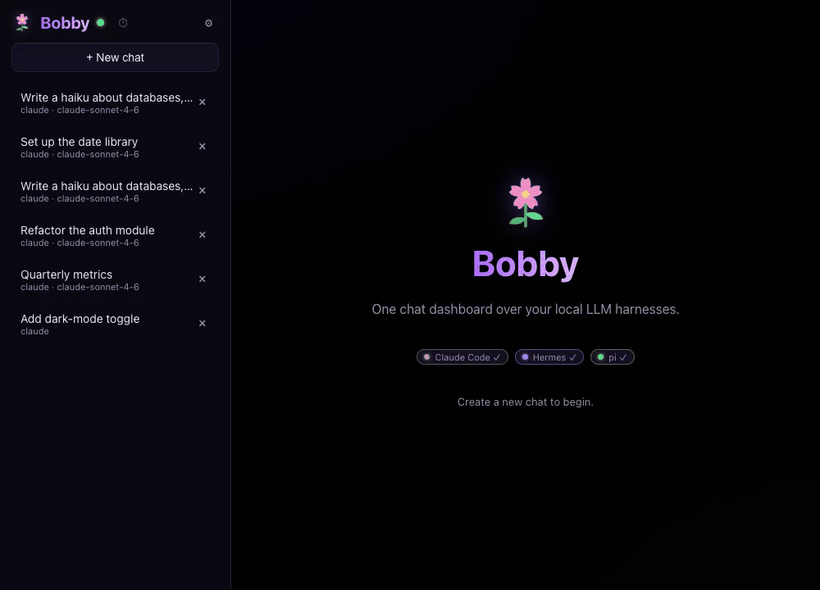
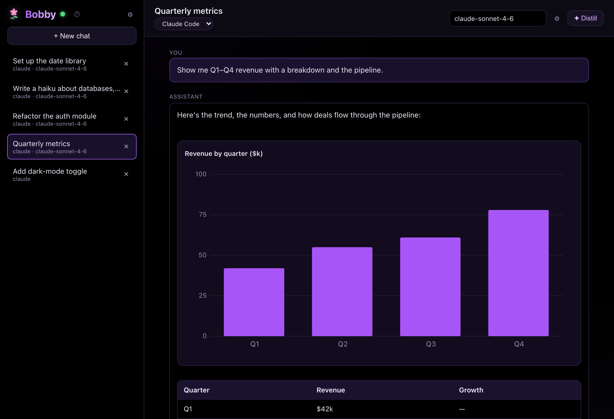
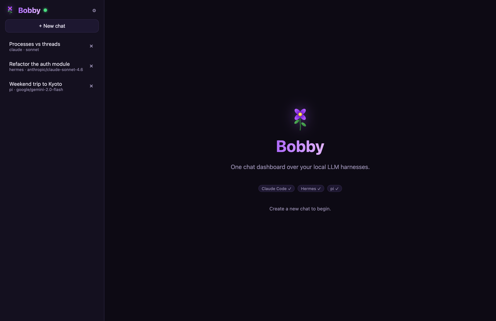
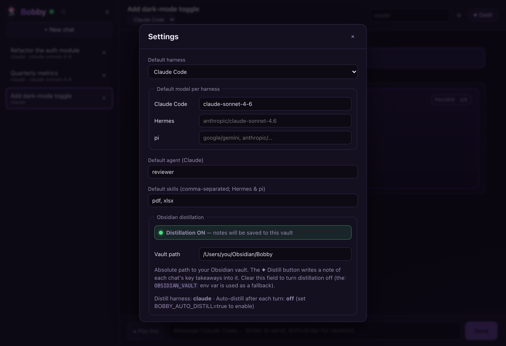
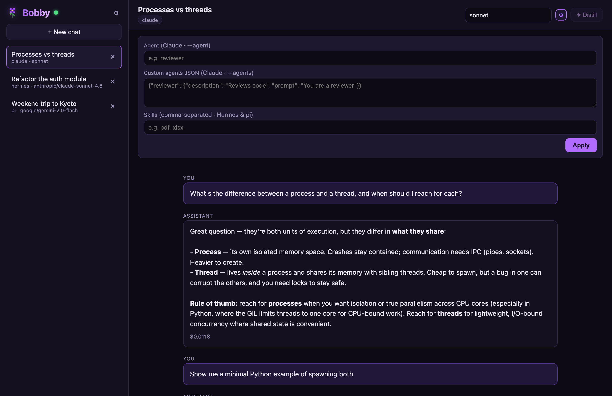
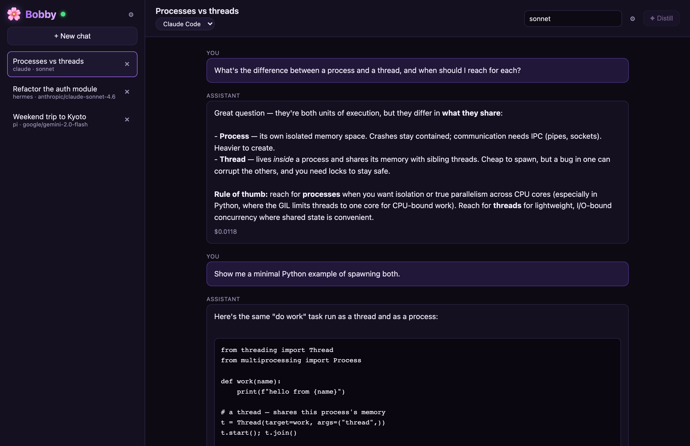
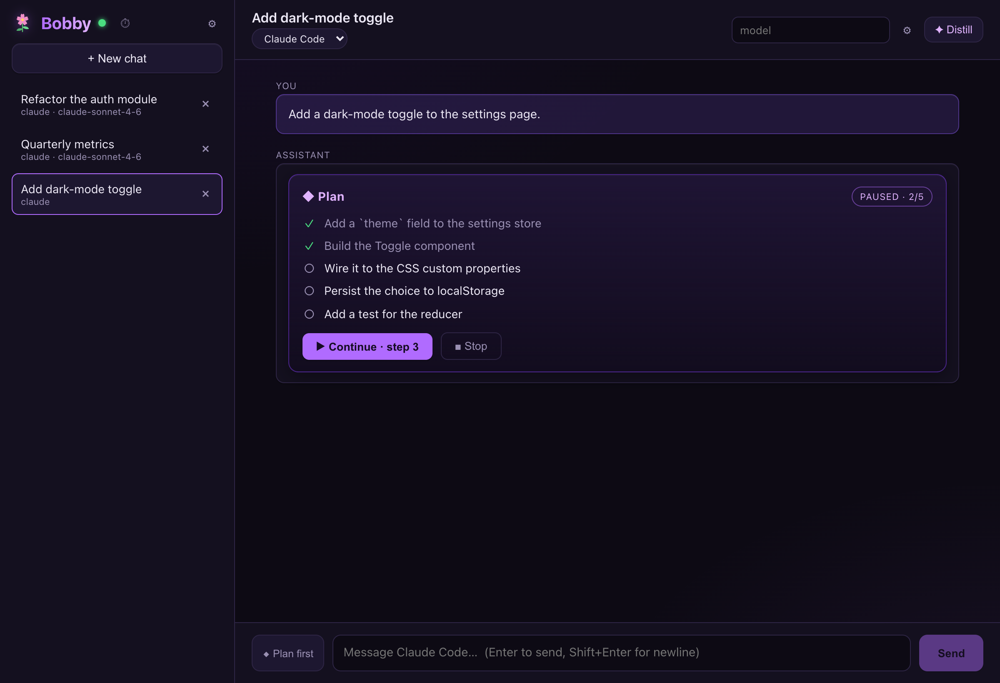
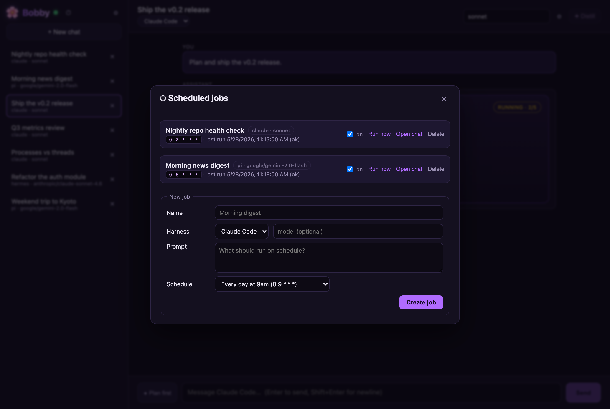

<div align="center">

# 🌸 Bobby

**One chat dashboard over the LLM harnesses you already run.**

Talk to **Claude Code**, **Hermes**, **pi** — or any harness you add — from a single
window. Every chat saved to your own database; every conversation distillable into
your **Obsidian** knowledge base.

<p>
  
  
  
  
</p>



<sub>A real, unedited turn — type a prompt, watch Claude stream back, cost tracked, saved locally.</sub>

</div>

---

## Why Bobby?

You already run powerful LLM harnesses on your machine — coding agents and beyond.
What you *don't* have is one place to use them, compare them, and keep everything
they tell you. Bobby is that place — a thin, local-first dashboard that drives the
harness CLIs you already trust. Any harness works, not just coding ones; adding one
is a single adapter file.

- 🪟 **One window over many harnesses.** Switch harness *mid-chat*; ask all three
  the same question and compare.
- 🎚️ **Your model, your tools, per chat.** Change the model anytime, attach custom
  **agents** (Claude `--agent`/`--agents`) and **skills** (Hermes/pi) — or set
  defaults once in Settings.
- 🧭 **Plan, then execute.** Toggle **Plan first** and Bobby proposes a step-by-step
  plan you review before anything runs — then executes it one step at a time, with
  live status. Not full-yolo.
- ⏱️ **Schedule anything.** Run a prompt against any harness on a cron schedule —
  morning digests, nightly checks — each job recorded in its own chat.
- 💾 **Your chats are yours.** Every message lands in a local SQLite database you
  own, independent of each harness's own session store.
- 🧠 **Knowledge, not just transcripts.** Distill any chat into atomic notes written
  straight into your Obsidian vault — automatically or on demand.
- 📊 **Rich output.** Replies render real widgets — charts, diagrams (Mermaid),
  tables, and code — not just walls of text.
- 🖥️ **Runs anywhere.** A browser tab (`pnpm dev`) or a native desktop app
  (`pnpm desktop`, packaged to `.dmg`/`.exe`/`AppImage`).
- 🧩 **Open & extensible.** Adding a new harness is one adapter file. MIT licensed.

## Screenshots



<sub>Replies render as widgets — charts, tables, and Mermaid diagrams.</sub>

| Multi-harness sidebar + welcome | Global settings |
| :---: | :---: |
|  |  |
| **Per-chat agents & skills** | **Live streaming + code + cost** |
|  |  |
| **Plan, then execute step by step** | **Scheduled cron jobs** |
|  |  |

## Quick start

**Prerequisites:** [Node](https://nodejs.org) ≥ 20, [pnpm](https://pnpm.io)
(`npm i -g pnpm`), and at least one harness CLI on your `PATH` — `claude`,
`hermes`, or `pi`.

**One line — clone, install, run:**

```bash
git clone https://github.com/ramanbht/bobby bobby && cd bobby && pnpm install && pnpm dev
```

Then open **http://localhost:5173**, hit **+ New chat**, pick a harness, and type.

<details>
<summary>Step by step</summary>

```bash
git clone https://github.com/ramanbht/bobby bobby && cd bobby
pnpm install            # installs deps, compiles the SQLite native module
cp .env.example .env    # optional — everything has sane defaults
pnpm dev                # ▶ web UI on http://localhost:5173, API on :8787
```

</details>

> Other commands: `pnpm test` (run the suite), `pnpm build` then `pnpm start`
> (production — serves UI + API on one origin at http://localhost:8787), `pnpm typecheck`.

## Desktop app

Prefer a native window over a browser tab?

```bash
pnpm desktop        # run Bobby in its own window (Electron) — boots the server for you
pnpm desktop:dist   # build a double-click installer → packages/desktop/release/
```

`pnpm desktop:dist` produces a real installer (`.dmg` on macOS, `.exe` on Windows,
`AppImage` on Linux). The server is bundled into a single file and runs in-process;
the native SQLite module is rebuilt for Electron automatically, so the packaged app
is fully self-contained.

> Note: `desktop:dist` recompiles `better-sqlite3` for Electron's ABI. If you then
> want to run `pnpm dev` / `pnpm test` (which use system Node), run `pnpm install`
> once to restore it.

## Updating

Bobby updates by pulling the repo and restarting — there's no auto-updater. **Your
chats are safe:** they live in `~/Library/Application Support/Bobby` (see
[Configuration](#configuration)), separate from the code you pull.

```bash
pnpm refresh          # git pull (fast-forward) + pnpm install + pnpm build
```

Then restart however you run Bobby:

| You run Bobby with… | Update with |
|---|---|
| `pnpm dev` | stop it, then `pnpm refresh && pnpm dev` |
| `pnpm start` | stop it, then `pnpm refresh && pnpm start` |
| **launchd daemon** | `pnpm daemon:update` — refresh **and** reload the daemon in one step |
| `pnpm desktop` (from source) | quit it (tray 🌸 → Quit), then `pnpm refresh && pnpm desktop` |
| installed `.dmg`/`.exe` | `pnpm refresh && pnpm desktop:dist`, then open the new file in `packages/desktop/release/` |

`pnpm refresh` uses `git pull --ff-only`, so it stops cleanly if your working tree
has local commits/changes instead of creating a merge. If `pnpm install` ever leaves
the native SQLite module mismatched (an ABI error on boot), run `pnpm install` again
or `pnpm rebuild better-sqlite3`.

## Configuration

Everything is environment variables (see [`.env.example`](.env.example)) — all optional:

| Variable | Default | What it does |
|---|---|---|
| `PORT` | `8787` | API/WebSocket port |
| `BOBBY_DB` | `./data/bobby.sqlite` | Where your chats are stored |
| `OBSIDIAN_VAULT` | *(unset)* | Absolute path to your vault. Unset ⇒ distillation off (or set it in **Settings ⚙**) |
| `OBSIDIAN_FOLDER` | `Bobby` | Subfolder for distilled notes |
| `BOBBY_DISTILL_HARNESS` | `claude` | Harness used for the distillation pass |
| `BOBBY_AUTO_DISTILL` | `false` | Distill automatically after each turn |
| `BOBBY_CLAUDE_PERMISSION_MODE` | `acceptEdits` | Claude tool-permission mode |

## Knowledge base (distillation)

Distillation turns a chat into atomic notes in your **Obsidian** vault. It's **off
until you tell Bobby where your vault is** — the ✦ Distill button stays disabled
and explains this when no vault is set. To enable it, point Bobby at your vault one
of two ways:

- **Settings ⚙ (recommended)** — open **Settings** in the sidebar and paste your
  vault's absolute path into **Obsidian distillation → Vault path**. A live
  indicator shows *Distillation ON/OFF*, and ✦ Distill enables immediately (no
  restart). Stored in Bobby's database.
- **`OBSIDIAN_VAULT` env var** — set it before launch as a fallback (see the table
  above). The Settings value wins if both are set.

Once a vault is configured, hit **✦ Distill** in any chat header to save a note on
demand, or set `BOBBY_AUTO_DISTILL=true` to distill automatically after every turn.
Notes land in the `OBSIDIAN_FOLDER` subfolder (default `Bobby`).

> Not sure of your vault's path? It's the folder you selected when you created the
> vault in Obsidian (**Settings → About**, or right-click the vault in Obsidian's
> vault switcher → *Reveal in Finder/Explorer*).

## Customizing chats

- **Settings (⚙ in the sidebar)** — default harness, a default model per harness,
  default agent/skills for new chats, and your **Obsidian vault path** (which turns
  on the ✦ Distill button). Stored server-side.
- **Per-chat model** — the model field in the chat header is editable anytime; the
  next turn uses it.
- **Switch harness mid-chat** — the harness dropdown in the chat header; Bobby
  replays the conversation to the new harness so context carries over.
- **Edit & re-run** — hover any message you sent and hit **✎ edit**: Bobby rewrites
  it, discards everything after, and re-runs the conversation from that point.
- **Agents & skills (⚙ in the chat header)** — per harness, best-effort:

  | Field | Claude | Hermes | pi |
  |-------|--------|--------|----|
  | Agent | `--agent <name>` | — | — |
  | Custom agents JSON | `--agents <json>` | — | — |
  | Skills | — | `--skills a,b` | `--skill a --skill b` |

## Plan-then-execute

Flip the **◆ Plan first** toggle next to the composer and send a task. Instead of
acting immediately, the harness returns a numbered plan — rendered as a checklist —
with **tools hard-disabled during the plan turn on every harness** (Claude
`--permission-mode plan`, Hermes `-t ""`, pi `--no-tools`). Review it, hit
**Approve & run**, and Bobby runs **step 1 only**, then **pauses** for an explicit
**Continue** before each subsequent step (○ pending → ◐ running → ✓ done). You can
**Stop** between or during any step. Truly not-yolo.

## Scheduled jobs

Open **⏱ Scheduled jobs** in the sidebar to run a prompt on a cron schedule. Pick a
harness, a model, a prompt, and a schedule (presets like *every day at 9am*, or a raw
cron expression). Each job records its runs in a dedicated chat, and run output
streams live into any open window. Toggle jobs on/off, **Run now**, or delete.

### Keeping jobs fired when the UI is closed

Two levels of always-on:

- **Tray mode (default in the desktop app).** Close the window — Bobby keeps running
  in the menu bar (look for the 🌸). The server stays up, so **scheduled jobs keep
  firing**. Quit is explicit (tray menu or ⌘Q).
- **macOS launchd daemon.** For "fires even on a fresh login, no app open":

  ```bash
  pnpm build              # first time only
  pnpm daemon:install     # installs ~/Library/LaunchAgents/dev.bobby.server.plist
  pnpm daemon:status      # check it's running
  pnpm daemon:uninstall   # remove it
  ```

  The agent runs the server on login + relaunches on crash (RunAtLoad + KeepAlive),
  writes data to `~/Library/Application Support/Bobby/`, logs to
  `~/Library/Logs/Bobby/`, and exposes the UI at <http://localhost:8787>.

## How it works

```
                 ┌──────────────┐   WebSocket    ┌─────────────────────────┐
   React UI ◄────►│   Fastify    │◄──────────────►│  Adapter (per harness)  │
  (packages/web)  │   server     │  HarnessEvent  │  claude · hermes · pi   │
                 │ packages/    │     stream     └───────────┬─────────────┘
                 │  server      │                            │ spawns CLI
                 │              │                  ┌─────────▼─────────┐
                 │  SQLite ◄────┼── saves chats    │  claude / hermes  │
                 │  (canonical) │                  │  / pi subprocess  │
                 │  Distiller ──┼──► Obsidian      └───────────────────┘
                 └──────────────┘
```

Each **adapter** is the only code that knows a harness's CLI quirks. It spawns the
harness and normalizes whatever it emits into one `HarnessEvent` stream. The server
persists that stream to SQLite and forwards it to the browser, so the UI speaks one
dialect regardless of which agent is answering.

| Harness | Native mode Bobby uses | Streaming | Resume |
|---------|------------------------|-----------|--------|
| Claude Code | `claude -p --output-format stream-json` | token-level | `-r <session id>` |
| pi | `pi -p --mode json` | per-turn | `--session <id>` |
| Hermes | `hermes acp` (Agent Client Protocol) | token-level † | via Bobby history |

† Bobby streams Hermes turns over ACP — the adapter forwards each `agent_message_chunk`
as it arrives. Planning turns use `hermes -z … -t ""` instead, to hard-disable tools while
planning (ACP has no per-call tool toggle). How granular the live stream looks depends on
your Hermes build/provider — some buffer the reply into one chunk before sending it.

## Testing

```bash
pnpm test     # 61 tests, fully offline — no harness or network needed
```

Covers the pure harness-output parsers (Claude stream-json, hermes ACP
`session/update` mapping, pi JSON extraction, distill note parsing) and the HTTP
API end-to-end via Fastify `inject` (chat CRUD, per-chat model/agent/skills,
settings, validation). For the full end-to-end gate (typecheck + tests + build +
REST/WS smoke), run `pnpm e2e`.

## Roadmap

- Token streaming for pi (`--mode rpc`) — the adapter interface already supports
  it.
- Richer tool-call/diff rendering in the chat view.
- More knowledge-base targets beyond Obsidian.

Contributions welcome — see [CONTRIBUTING.md](CONTRIBUTING.md) for the (short) guide
to adding a harness adapter.

## License

[MIT](LICENSE) — © 2026 Bobby contributors.
